# BeautySense: Multimodal Wearable & Mobile AI Makeup Companion

<div align="center">

[](https://github.com/Karl-XZ/BeautySense)
[](https://github.com/Karl-XZ/BeautySense)
[](https://github.com/Karl-XZ/BeautySense)
[](https://github.com/Karl-XZ/BeautySense)
[](LICENSE)

**An intelligent, voice-first multimodal assistant that empowers users to independently explore cosmetics, style customized looks, find vanity items through tactile cues, and apply makeup with closed-loop audio guidance and visual verification.**

[Core Capabilities](#core-capabilities) • [Demonstration Gallery](#demonstration-gallery) • [System Architecture](#system-architecture) • [Hardware Specification](#v1-wearable-hardware-specification) • [Getting Started](#getting-started) • [Safety & Privacy](#safety-privacy--user-agency)

</div>

---

## Overview

**BeautySense** is a multimodal AI companion designed for the personal vanity table. It combines computer vision, natural conversational intelligence, step-by-step procedural planning, and spatial audio guidance to assist individuals through every phase of daily grooming.

Applying cosmetics demands continuous visual focus, fine manual dexterity, and spatial awareness. For individuals with low vision, visually impaired users, or near-sighted individuals who must remove corrective lenses in front of a mirror, identifying products, measuring dosage, locating application zones, and evaluating makeup results present substantial practical challenges. BeautySense bridges this gap by transforming complex visual tasks into clear, conversational, and hands-free audible steps.

The system supports two complementary form factors:
- **Android Mobile Application**: Uses smartphone cameras, microphone arrays, and spatial audio to deliver full-cycle consultation, personalized look creation, real-time makeup preview, and guided execution.
- **Wearable Headset Prototype**: Features a lightweight first-person camera, bone-conduction transducers, digital microphone, 6-axis IMU, and bilateral haptic actuators, enabling natural hands-free vanity operation.

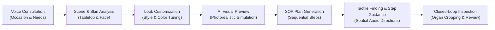

---

## Key Scenarios

- **Independent Accessibility Grooming**: Enables low-vision and visually impaired users to independently locate cosmetic items, measure application quantities, and apply makeup through verbal descriptions calibrated against physical landmarks (table edges, hands, container contours).
- **Corrective-Lens-Free Makeup**: Guides near-sighted users who remove glasses at the vanity mirror, offering clear verbal step-by-step instructions and high-resolution zoomed inspection.
- **Occasion-Driven Look Styling**: Rapidly devises matched cosmetic plans for professional presentations, roadshows, interviews, and evening events based on user preferences and existing tabletop items.
- **Senior-Friendly Interaction**: Features concise phrasing, adjustable speech pacing, full verbal replay, and single-action instructions that remove interface complexity.

---

## Core Capabilities

### 1. Natural Voice Consultation & Event Adaptation
Users state their destination and stylistic intent in natural language. The conversational agent assesses context, ambient lighting, and outfit to propose customized makeup directions, answering questions about skin prep and cosmetics selection.

### 2. Multi-Style Vanity Studio & AI Look Preview
The studio interface integrates a live mirror camera view and cosmetic item detection. Users flexibly select aesthetic genres (Natural, Commute, French Chic, K-Beauty Dewy, Vintage), foundation formulations (Liquid, Cushion, Powder, Tone-up), finishes (Matte, Satin, Dewy), and fine-tuned organ shades (lip tint, blush, eye palette, custom HEX values). The system synthesizes a realistic virtual preview directly onto the user's face prior to application.

### 3. Tactile Reference-Based Object Finding
For users operating without visual feedback, BeautySense articulates item positions relative to physical body anchors and table boundaries. Spatial audio and verbal instructions guide hands along the table edge to identify containers by geometry (square pump, cylindrical tube, compact case) before confirming products through tactile verification.

### 4. Dynamic Step-by-Step SOP Generation
Makeup plans are structured into atomic, sequentially verifiable steps. Each step details the specific cosmetic item, dosage recommendation (e.g., "a pea-sized drop"), facial placement zones, application stroke techniques, and estimated duration.

### 5. Closed-Loop Visual Inspection & Quality Review
After each step, the multimodal vision engine crops facial organs (eyes, cheeks, lips, nose) and compares current progress against the pre-makeup baseline. The agent reports completion status, notes subtle blending opportunities, and detects pigment boundary overflow, while keeping all final styling decisions in the user's control.

### 6. Posture Perception & Fall Risk Safeguards
An integrated 6-axis IMU monitors sudden posture changes or disorientation during grooming sessions. When irregular acceleration is detected, the assistant immediately pauses makeup guidance to check on the user's physical well-being.

---

## Demonstration Gallery

All screenshots below are captured from the authentic BeautySense application running on Android:

### Intelligent Consultation & Look Customization

| Home Dashboard | Voice Consultation | Makeup Styling Studio |
| :---: | :---: | :---: |
| 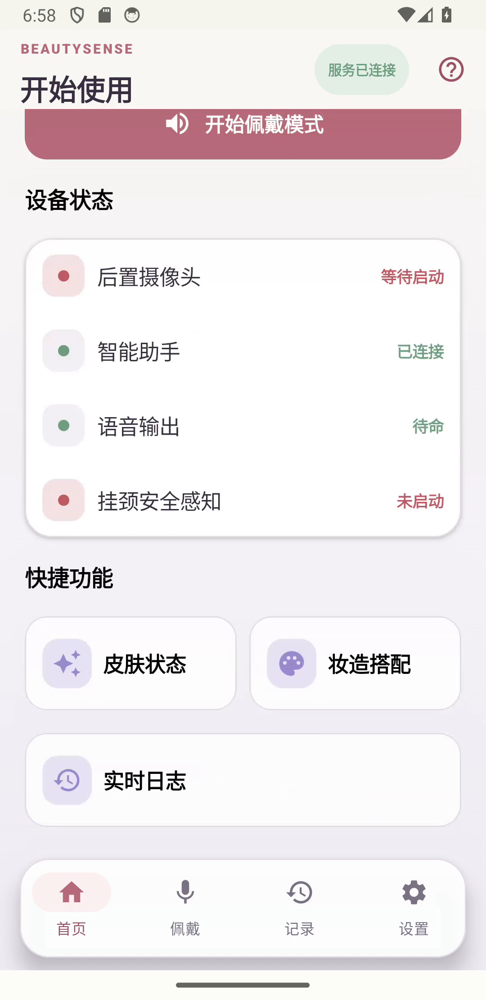 | 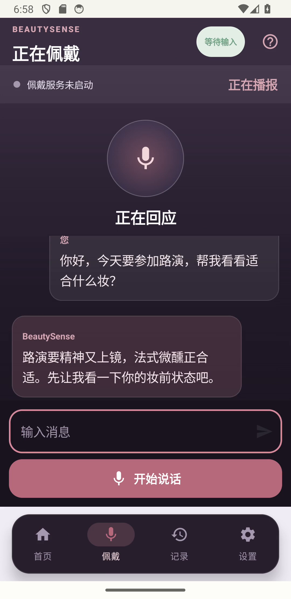 | 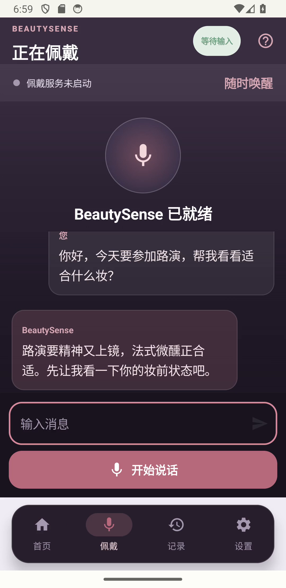 |
| *Device status, quick tools (Skin, Styling, Logs), and proactive voice greeting.* | *Contextual dialogue: "Attending a roadshow today, what makeup suits me?"* | *Real-time dual vanity view with detected cosmetics and style selectors.* |

| Cosmetic Palette Tuning | AI Look Preview | Structured SOP Plan |
| :---: | :---: | :---: |
| 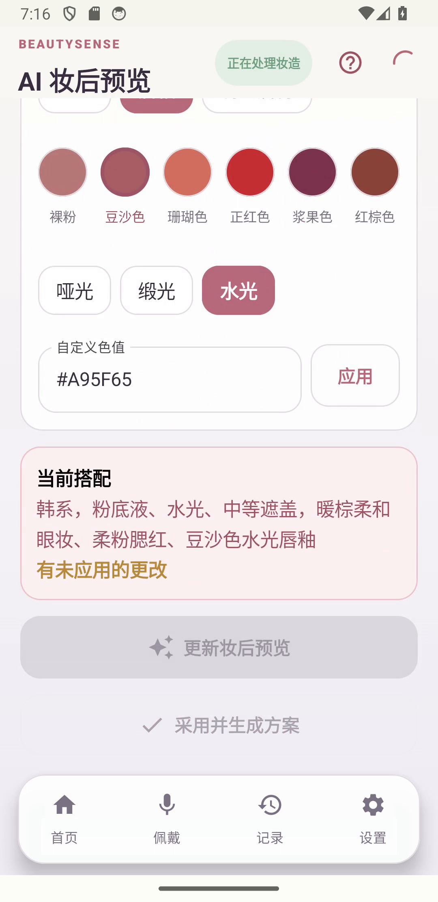 | 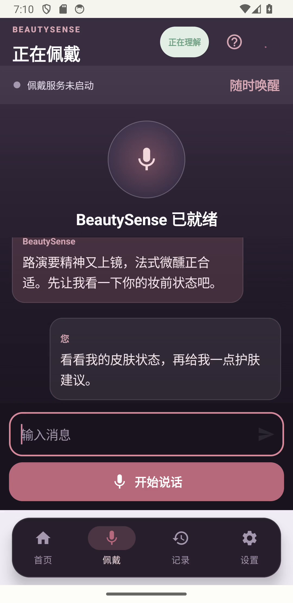 | 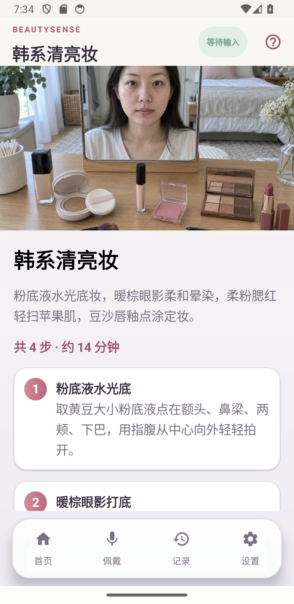 |
| *Precise lip tint shades, textures (Dewy, Satin, Matte), and HEX color control.* | *AI-synthesized makeup preview applied to facial geometry prior to application.* | *Structured breakdown: "Korean Dewy Fresh Look" (4 steps, ~14 minutes).* |

---

### Step Execution, Quality Inspection & Accessibility

| Step 1 Guidance & Execution | Visual Inspection Review | Step 2 Eye Makeup |
| :---: | :---: | :---: |
| 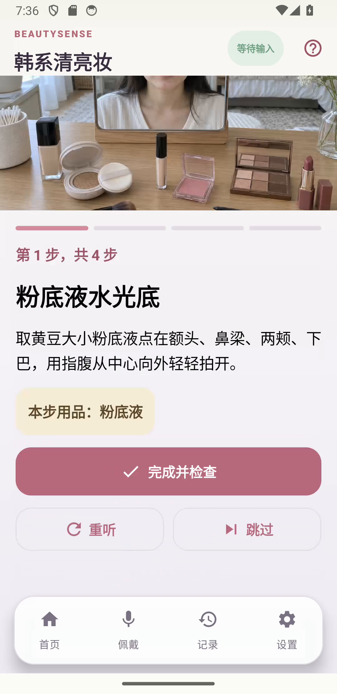 | 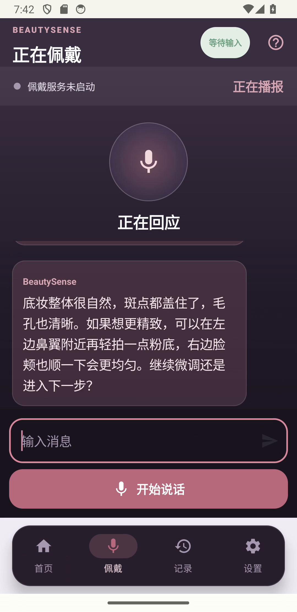 | 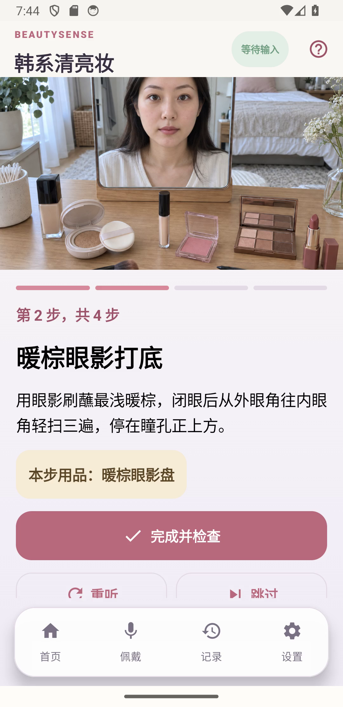 |
| *Step 1 Dewy Foundation: dosage ("pea-sized drop") and tapping instructions.* | *Multimodal feedback: "Even foundation coverage; tap lightly near left nostril."* | *Progresses to Step 2 Warm Brown Eyeshadow with brush stroke guidance.* |

| Tactile Reference Object Finding | Dual Interaction Modes & Peripherals |
| :---: | :---: |
| 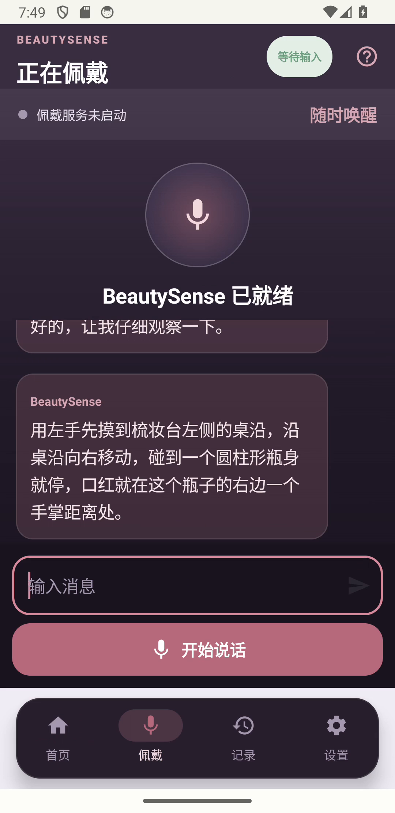 | 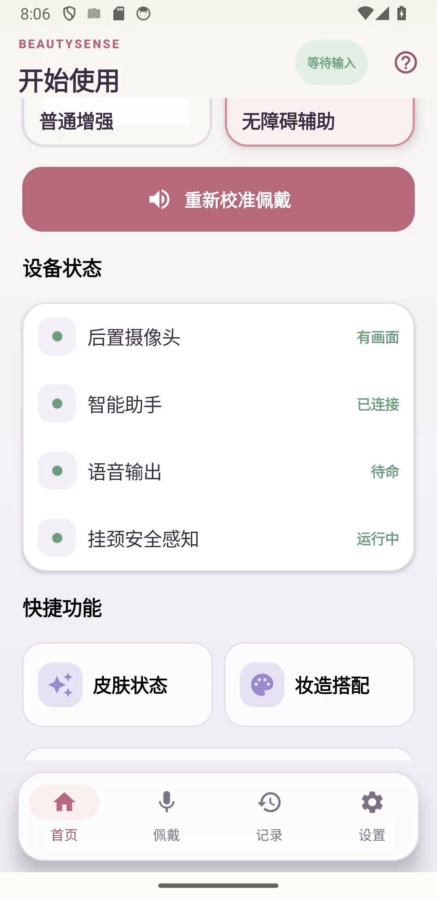 |
| *Voice guide: "Left hand finds the left table edge, slide right until touching a cylinder..."* | *Mode toggle (Enhanced / Accessibility) and live peripheral telemetry.* |

---

## System Architecture

```text
+-----------------------------------------------------------------------------------+
|                            User Interaction Surface                               |
|   Hands-free Voice Dialogue   |   Spatial Audio Beacons   |   Touch / Mobile UI   |
+-----------------------------------------------------------------------------------+
                                         |
                                         v
+-----------------------------------------------------------------------------------+
|                             Android Application Layer                             |
|  +-------------------------------------+  +------------------------------------+  |
|  |           WebView Frontend          |  |       Native Android Bridge        |  |
|  | - Single Page Application Shell     |  | - MainActivity.SilverCareBridge    |  |
|  | - Web Audio Binaural Spatial Engine |  | - CameraX High-Res Frame Capture   |  |
|  | - Dynamic Color & Style Selectors   |  | - AudioRecord PCM Stream Provider  |  |
|  | - High-Contrast Accessibility UI    |  | - System TTS & Sherpa-ONNX Fallback|  |
|  +-------------------------------------+  +------------------------------------+  |
+-----------------------------------------------------------------------------------+
                                         |
                                         v
+-----------------------------------------------------------------------------------+
|                        Multimodal Intelligence Engine                             |
|  +-------------------------+ +-------------------------+ +---------------------+  |
|  |   Conversational Agent  | |   Table Scene Analyzer  | | Face Organ Analyzer |  |
|  |   (DeepSeek / Qwen)     | |    (Qwen VL Flash)      | | (FaceOrganCropper)  |  |
|  | - Intent Understanding  | | - Cosmetic Item BBoxes  | | - 5-Organ Partition |  |
|  | - Dialogue State Track  | | - Shape & Anchor Logic  | | - Symmetry & Bounds |  |
|  +-------------------------+ +-------------------------+ +---------------------+  |
|                                                                                   |
|  +-------------------------+ +-------------------------+ +---------------------+  |
|  |  Structured SOP Planner | |   Visual Inspection LLM | |  Local Edge Models  |  |
|  |      (Qwen Plus)        | |     (Qwen VL Plus)      | |  (MNN Runtime)      |  |
|  | - Granular Task Steps   | | - Pre/Post Comparison   | | - DAMO-YOLO Vision  |  |
|  | - Dosage & Zone Prompts | | - Minimal Correction    | | - SenseVoice ASR    |  |
|  +-------------------------+ +-------------------------+ +---------------------+  |
+-----------------------------------------------------------------------------------+
                                         |
                                         v
+-----------------------------------------------------------------------------------+
|                      V1 Wearable Hardware Subsystem                               |
|  - Camera: OV5640 5MP (Vanity First-Person Field of View)                         |
|  - Motion: BMI270 6-Axis IMU (Head Orientation & Sudden Drop Detection)           |
|  - Audio Input: ICS-43434 High-SNR Digital Microphone                             |
|  - Audio Output: MAX98357A I2S Class-D Amp + Dual 8-Ohm Bone Conduction           |
|  - Haptic Feedback: PCA9540B I2C MUX + Dual DRV2605L + 0809 LRA Actuators         |
|  - Power & Comms: 1S LiPo + Magnetic 4-Pin Interface + Wi-Fi / BLE               |
+-----------------------------------------------------------------------------------+
```

---

## V1 Wearable Hardware Specification

The wearable headset is designed to capture a natural first-person perspective of the vanity mirror and tabletop while leaving both hands completely unobstructed.

### Core Component Baseline

| Component | Part / Spec | Quantity | Interface | Primary Function |
| :--- | :--- | :---: | :--- | :--- |
| **Camera Module** | Omnivision OV5640 (5MP) | 1 | DVP / MIPI | First-person video capture of cosmetics and facial reflection |
| **Motion Sensor** | Bosch BMI270 (6-Axis IMU) | 1 | I2C (`0x68`) | Head orientation tracking, tremor detection, fall protection |
| **Microphone** | InvenSense ICS-43434 | 1 | I2S | High-SNR voice command capture with ambient noise rejection |
| **Audio Amplifier**| Maxim MAX98357A | 1 | I2S | Direct digital-to-analog audio amplification |
| **Bone Conduction**| 8Ω Transducers (Parallel Mono) | 2 | Speaker Out | Open-ear audio guidance without blocking surrounding sounds |
| **Haptic Mux** | TI PCA9540B | 1 | I2C (`0x70`) | Dual-channel address isolation for identical haptic drivers |
| **Haptic Drivers** | TI DRV2605L | 2 | I2C (`0x5A`) | Independent left and right directional tactile pulses |
| **Haptic Motors** | 0809 Linear Resonant Actuator (LRA) | 2 | Diff Drive | Crisp directional arrival and alignment cues |
| **Power Supply** | Single-Cell 1S LiPo Battery | 1 | 3.7V - 4.2V | Lightweight wearable power system |
| **Charging & Data**| 4-Pin Magnetic Connector | 1 | USB / 5V | Convenient magnetic charging and firmware flashing |

### Hardware Controller Configurations

The system supports two complementary controller architectures:
- **Plan A (ESP32-S3-MINI-1U-N4R2)**: Dual-core Xtensa LX7 running at 240 MHz, integrated Wi-Fi and Bluetooth 5 LE, hardware cryptographic acceleration, and direct support for camera/audio peripherals.
- **Plan B (BK7258QN88616)**: Dual-core Star-MC1 architecture with 8MB PSRAM and 16MB Flash, optimized for ultra-low-power multimedia streaming.

Complete schematics, BOM lists, signal nets, and power tree designs reside under [`docs/hardware/integration/v1/`](docs/hardware/integration/v1/).

---

## Software Project Structure

```text
BeautySense/
├── app/                                    # Android application source code
│   ├── src/main/
│   │   ├── assets/                         # Web frontend assets & edge models
│   │   │   ├── index.html                  # Main SPA interface shell
│   │   │   ├── offline/                    # Bundled offline MNN models (DAMO-YOLO)
│   │   │   └── static/
│   │   │       ├── css/                    # Stylesheets (layout, animations, components)
│   │   │       ├── js/                     # Modular frontend logic
│   │   │       │   ├── audio.js            # Web Audio binaural spatial positioning
│   │   │       │   ├── input.js            # Voice, touch, and sensor event routing
│   │   │       │   ├── network.js          # REST / WebSocket communication bridge
│   │   │       │   └── ui.js               # UI controller and visual state rendering
│   │   │       └── images/                 # App icon and graphical assets
│   │   ├── cpp/                            # Native MNN runtime bridge and C++ wrappers
│   │   ├── java/com/silvercare/aiassistant/# Core business logic & Android bridges
│   │   │   ├── MainActivity.java           # Android activity, WebView setup, bridges
│   │   │   ├── FaceOrganCropper.java       # 5-organ facial region segmentation
│   │   │   ├── MemoryStore.java            # Cosmetic inventory and spatial memory store
│   │   │   └── SilverCareProcessor.java    # Multimodal orchestration and SOP state machine
│   │   └── res/                            # Native Android resources, layouts, strings
│   └── build.gradle                        # App-level Gradle build configuration
├── docs/                                   # Architectural documentation & assets
│   ├── images/                             # Real demonstration screenshots
│   ├── functional-architecture-zh.md       # Comprehensive functional architecture
│   ├── diagnostic-logging-zh.md            # Logging and diagnostic specifications
│   └── hardware/integration/v1/            # Wearable hardware schematics, BOM, pin matrix
├── hardware/                               # Hardware prototyping and bench tests
└── test_images/                            # Standard test images for verification
```

---

## Getting Started

### Prerequisites

- **Android Studio**: Iguana (2023.2.1) or newer
- **Android SDK**: API Level 34 (Android 14) minimum, target API Level 35
- **JDK**: Java Development Kit 17 (recommended: Eclipse Temurin or Android Studio bundled JDK)
- **Node.js**: v18.0+ (required for frontend test runners)

### Setup & Compilation

1. **Clone the Repository**:
   ```bash
   git clone https://github.com/Karl-XZ/BeautySense.git
   cd BeautySense
   ```

2. **Configure Cloud API Keys (Optional)**:
   Create a `local.properties` file in the project root to enable cloud multimodal processing (this file is excluded by `.gitignore`):
   ```properties
   DASHSCOPE_API_KEY=your_dashscope_api_key_here
   ```

3. **Build the Android Application**:
   ```powershell
   # On Windows PowerShell
   .\gradlew.bat :app:assembleDebug --no-daemon
   ```

4. **Run Unit Tests**:
   ```powershell
   .\gradlew.bat :app:testDebugUnitTest --no-daemon
   ```

5. **Deploy to Device or Emulator**:
   ```powershell
   adb install -r app/build/outputs/apk/debug/app-debug.apk
   ```

---

## Safety, Privacy & User Agency

- **User-Centric Control**: The assistant provides non-prescriptive, objective observations. Every styling adjustment, shade substitution, and micro-correction remains an explicit choice of the user.
- **Physical Safety Safeguards**: The 6-axis IMU actively detects sudden head drops or erratic movement. If potential distress is sensed, the assistant suspends cosmetic procedures immediately and requests confirmation of well-being.
- **Strict Privacy Boundaries**: Facial images and camera feeds are evaluated strictly in transient memory buffers for real-time inference. Facial images and skin metrics are persisted to long-term storage only upon explicit user consent, and users can delete their recorded history at any time.
- **Secure Credential Storage**: Cloud model credentials reside entirely on private endpoints and local developer configuration files, ensuring no secret leakage into public version control.

---

## License

This project is licensed under the Apache License 2.0. Third-party runtime dependencies (MNN, Sherpa-ONNX, Vosk, DashScope Client) are governed by their respective open-source licenses and terms of service.
