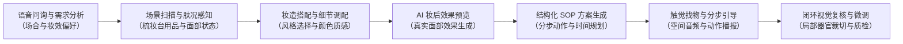

# BeautySense：多模态可穿戴 AI 美妆伙伴

<div align="center">

[](https://github.com/Karl-XZ/BeautySense)
[](https://github.com/Karl-XZ/BeautySense)
[](https://github.com/Karl-XZ/BeautySense)
[](https://github.com/Karl-XZ/BeautySense)
[](LICENSE)

**让美的选择与呈现始终掌握在用户自己手中。BeautySense 是一款语音优先、软硬一体的多模态 AI 美妆伙伴，支持自主妆容搭配、AI 妆后预览、基于物理参照的触觉找物、单动作语音分步指导与闭环妆效复核。**

[核心能力](#核心能力) • [实机演示](#实机演示) • [系统架构](#系统架构) • [硬件规格](#v1-可穿戴硬件方案) • [快速上手](#快速上手) • [安全与隐私边界](#安全隐私与用户自主权)

</div>

---

## 项目概述

**BeautySense** 是一位能看、能听、能对话的智能美妆伙伴，专注于解决日常梳妆台前“手边有什么、下一步怎么做、刚才那一步画得怎么样”的核心需求。

化妆过程持续占用双手与视线。针对视力受限群体、摘镜化妆的近视人群，辨认化妆品、控制用量、找准面部位置与确认妆效存在诸多现实阻碍。BeautySense 将视觉理解、自然对话、分步动作规划与闭环质检融合于统一任务流中，把复杂的视觉识别转化为清晰可执行的语音指引，全程陪伴用户完成日常妆容。

系统提供两种互补的产品形态：
- **Android 移动应用**：结合手机摄像头、麦克风、扬声器与姿态传感器，支持全流程语音咨询、个性化妆造搭配、AI 妆后预览、皮肤状态记录、单动作指导与妆效复核。挂颈使用时可提供近似第一视角的连续观察。
- **头戴式硬件样机**：集成前向摄像头、双侧骨传导扬声器、数字麦克风阵列、六轴惯性传感器（IMU）与双侧线性触觉单元，实现真正解放双手的沉浸式第一视角美妆辅助。



---

## 主要服务场景

- **视力障碍与低视力自主梳妆**：默认全流程无需目视界面，通过身体、手掌、桌沿及用品几何形状（圆柱瓶、方瓶、泵头）建立触觉坐标系，指引双手准确拿取产品并完成上妆。
- **近视摘镜化妆指引**：服务于在梳妆镜前摘下眼镜的用户，提供清晰口播操作与 2.5 倍局部特写放大，协助把控眼周、唇线与腮红细节。
- **日常场合快速妆造搭配**：面向路演、职场通勤、聚会等特定场景，根据着装、肤质与手边现有化妆品快速定制方案，避免盲目尝试。
- **银龄友好极简交互**：采用单句慢速播报、单动作逐项确认与完整重读机制，减轻复杂界面的认知负担。

---

## 核心能力

### 1. 自然语音咨询与场合适配
用户通过日常口语表达出行需求与风格意向（例如“今天要参加路演，想精神一点，别太浓”）。系统综合考量环境光线、面部基础与着装风格，提供针对性的妆容方向与护肤准备建议。

### 2. 妆造自由搭配与 AI 妆后预览
在妆造工作室中，用户可自由选择风格类别（自然、通勤、法式、韩系、复古）、底妆类型（粉底液、气垫、粉饼、素颜霜）、质感（哑光、自然、水光）与遮盖度。系统支持五官细分调色（眼妆、腮红、唇釉色号与十六进制自定义颜色），并在动笔前生成贴合用户真实面部轮廓的高保真妆后预览。

### 3. 基于物理参照系的触觉找物
针对视力受限场景，系统将找物指引规范为五个核心要素：使用哪只手、起点位置、移动方向、触碰形状、何时停止。以桌沿、掌心、瓶身轮廓为物理基准，辅以立体声空间音频提示，结合用户触摸反馈双重确认目标产品。

### 4. 动态分步 SOP 生成与单动作引导
确定方案后，系统将化妆流程拆解为细粒度、按顺序执行的原子步骤（标明用品名称、取用剂量如“黄豆大小”、点涂分布与涂抹手法）。语音每次仅播报当前动作，支持随时打断、暂停、重听或跳过。

### 5. 闭环视觉复核与智能质检
单步完成后，多模态视觉引擎（Qwen VL Plus / DAMO-YOLO 与 FaceOrganCropper）对比妆前基线与当前状态，准确识别完成情况，提示轻微修整点（如鼻翼轻拍、唇角匀色），检测色彩边界溢出，并在证据不足时主动提示用户轻微转头配合采集，所有调整决定权均保留给用户。

### 6. 姿态感知与跌倒安全保障
设备集成六轴惯性传感器监测运动姿态。当检测到身体异常晃动或疑似跌倒时，系统即刻暂停化妆指引，优先进行安全询问，确认无恙后恢复原步骤。

---

## 实机演示

以下截图全部来源于 BeautySense 在 Android 真实环境下的运行实录：

### 智能咨询与个性化妆造搭配

| 主页控制台 | 语音咨询与场合建议 | 妆造工作室 |
| :---: | :---: | :---: |
|  |  |  |
| *设备状态、安全感知、皮肤状态/妆造搭配/实时日志入口与智能语音问候。* | *“今天要参加路演，帮我看看适合什么妆？”对话响应与妆容推荐。* | *实时双视角画面：梳妆镜面部反射与桌面化妆品摆放。* |

| 彩妆色彩精细调配 | AI 妆后效果预览 | 结构化 SOP 方案总览 |
| :---: | :---: | :---: |
|  |  |  |
| *唇釉色系（豆沙/珊瑚/正红等）、质感选择与十六进制颜色自定义。* | *动笔前在用户真实面部几何上生成合成妆效预览。* | *“韩系清亮妆”结构化分解（共 4 步 · 约 14 分钟）。* |

---

### 分步执行、视觉复核与无障碍交互

| 第一步底妆指引与执行 | 妆效视觉复核与修整反馈 | 第二步眼影进阶指引 |
| :---: | :---: | :---: |
|  |  |  |
| *取黄豆大小点拍手法指导、用品高亮与“完成并检查”入口。* | *多模态复核反馈：“底妆整体自然，左边鼻翼附近可轻拍修整”。* | *步骤推进至暖棕眼影打底，细化闭眼轻扫手法与停留位置。* |

| 触觉参照物定位找物 | 交互模式切换与外设遥测 |
| :---: | :---: |
|  |  |
| *语音引导：“左手摸梳妆台左侧桌沿，向右移动碰到圆柱瓶身即停，口红在右侧一掌处”。* | *普通增强与无障碍辅助双模式切换，后置相机/语音/安全感知运行遥测。* |

---

## 系统架构

```text
+-----------------------------------------------------------------------------------+
|                                  用户交互界面                                     |
|     免手持语音对话      |      立体声空间音频指引      |      触控 / 移动端 UI     |
+-----------------------------------------------------------------------------------+
                                         |
                                         v
+-----------------------------------------------------------------------------------+
|                                 Android 应用运行层                                |
|  +-------------------------------------+  +------------------------------------+  |
|  |           WebView 前端界面          |  |          Android 原生桥接层        |  |
|  | - 单页应用架构与自适应布局          |  | - MainActivity.SilverCareBridge    |  |
|  | - Web Audio 双耳空间音频定位引擎    |  | - CameraX 高清视频流帧捕获         |  |
|  | - 妆造风格与色号调配面板            |  | - AudioRecord PCM 音频流采集       |  |
|  | - 高对比度无障碍交互模式            |  | - 系统 TTS 与 Sherpa-ONNX 兜底     |  |
|  +-------------------------------------+  +------------------------------------+  |
+-----------------------------------------------------------------------------------+
                                         |
                                         v
+-----------------------------------------------------------------------------------+
|                                多模态智能推理引擎                                 |
|  +-------------------------+ +-------------------------+ +---------------------+  |
|  |      自然对话 Agent     | |     桌面场景视觉分析    | |     面部器官定位    |  |
|  |    (DeepSeek / Qwen)    | |     (Qwen VL Flash)     | |  (FaceOrganCropper) |  |
|  | - 意图理解与上下文管理  | | - 桌面化妆品定位与识别  | | - 五官区域定位分割  |  |
|  | - 任务状态机推进        | | - 几何轮廓与物理参照推算| | - 对称度与溢出量化  |  |
|  +-------------------------+ +-------------------------+ +---------------------+  |
|                                                                                   |
|  +-------------------------+ +-------------------------+ +---------------------+  |
|  |    结构化 SOP 规划器    | |    妆效视觉复核质检     | |     端侧轻量模型    |  |
|  |       (Qwen Plus)       | |     (Qwen VL Plus)      | |     (MNN Runtime)   |  |
|  | - 动作原子化步骤分解    | | - 妆前妆后精细对比      | | - DAMO-YOLO 目标检测|  |
|  | - 取量/手法/分区参数提示| | - 最小幅度修整建议生成  | | - SenseVoice 离线ASR|  |
|  +-------------------------+ +-------------------------+ +---------------------+  |
+-----------------------------------------------------------------------------------+
                                         |
                                         v
+-----------------------------------------------------------------------------------+
|                               V1 可穿戴硬件子系统                                 |
|  - 视觉采集：OV5640 500 万像素摄像头（第一人称视角）                             |
|  - 运动感知：BMI270 六轴 IMU（头部姿态跟踪与异常跌倒感知）                        |
|  - 语音输入：ICS-43434 高信噪比数字麦克风（免手持拾音与降噪）                     |
|  - 音频输出：MAX98357A I2S 功放 + 双侧 8Ω 骨传导单元（开放双耳安全播报）          |
|  - 触觉反馈：PCA9540B I2C 多路复用 + 双 DRV2605L + 0809 LRA 线性马达（双侧触觉）  |
|  - 供电通信：1S 锂电池 + 4Pin 磁吸接口 + Wi-Fi / 低功耗蓝牙                       |
+-----------------------------------------------------------------------------------+
```

---

## V1 可穿戴硬件方案

头戴硬件样机专注于第一人称梳妆台视野采集，耳道完全开放，双手彻底释放。

### 核心器件选型清单

| 元器件 | 型号 / 规格 | 数量 | 接口协议 | 核心功能 |
| :--- | :--- | :---: | :--- | :--- |
| **摄像头模块** | Omnivision OV5640（500万像素） | 1 | DVP / MIPI | 第一人称采集桌面化妆品布局与面部镜面反射 |
| **惯性传感器** | Bosch BMI270（六轴 IMU） | 1 | I2C (`0x68`) | 头部朝向、异常晃动与跌倒安全感知 |
| **数字麦克风** | InvenSense ICS-43434 | 1 | I2S | 免手持语音指令拾音与环境降噪 |
| **音频功放** | Maxim MAX98357A | 1 | I2S | 高能效数字音频功率放大 |
| **骨传导单元** | 8Ω 骨传导震子（并联单声道） | 2 | Speaker Out | 开放双耳的语音操作指引播报 |
| **触觉复用器** | TI PCA9540B | 1 | I2C (`0x70`) | 隔离双路相同 I2C 地址的触觉驱动芯片 |
| **触觉驱动器** | TI DRV2605L | 2 | I2C (`0x5A`) | 左右独立控制的高精度触觉波形驱动 |
| **线性马达** | 0809 LRA 线性谐振执行器 | 2 | 差分驱动 | 左右两侧方向指引与对齐到达脉冲提示 |
| **可充电电池** | 单节 1S 锂聚合物电池 | 1 | 3.7V - 4.2V | 轻量化随身供电 |
| **磁吸接口** | 4-Pin 磁吸连接器 | 1 | 5V / GND / USB | 便捷磁吸供电充电与固件下载 |

### 主控方案评估

硬件支持两套主控基准并行验证：
- **方案 A（ESP32-S3-MINI-1U-N4R2）**：双核 Xtensa LX7，240 MHz 主频，原生集成 Wi-Fi 与蓝牙 5 LE，外设接口丰富，开发生态成熟。
- **方案 B（BK7258QN88616）**：双核 Star-MC1 架构，内置 8MB PSRAM 与 16MB Flash，专为音视频流媒体设计的超低功耗多媒体芯片。

完整原理图设计规范、BOM 清单、信号网络与引脚分配矩阵详见 [`docs/hardware/integration/v1/`](docs/hardware/integration/v1/)。

---

## 软件工程目录结构

```text
BeautySense/
├── app/                                    # Android 客户端源码
│   ├── src/main/
│   │   ├── assets/                         # WebView 前端资产与端侧模型
│   │   │   ├── index.html                  # 单页应用主结构
│   │   │   ├── offline/                    # 端侧轻量化 MNN 模型（DAMO-YOLO）
│   │   │   └── static/
│   │   │       ├── css/                    # 界面样式表（布局、动画、组件）
│   │   │       ├── js/                     # 模块化前端脚本
│   │   │       │   ├── audio.js            # Web Audio 双耳空间声像渲染
│   │   │       │   ├── input.js            # 语音、触控与传感器事件分发
│   │   │       │   ├── network.js          # REST / WebSocket 通信通道
│   │   │       │   └── ui.js               # 界面状态渲染与交互响应
│   │   │       └── images/                 # 图标与图形资产
│   │   ├── cpp/                            # MNN 底层推理 C++ JNI 桥接
│   │   ├── java/com/silvercare/aiassistant/# Android 核心业务逻辑与原生桥
│   │   │   ├── MainActivity.java           # 主 Activity、WebView 设置与 Native 桥接
│   │   │   ├── FaceOrganCropper.java       # 面部五官器官定位与区域裁剪
│   │   │   ├── MemoryStore.java            # 化妆品长期记忆与位置存储
│   │   │   └── SilverCareProcessor.java    # 多模态业务编排与 SOP 状态机推进
│   │   └── res/                            # Android 原生资源、布局与字符串
│   └── build.gradle                        # 应用级 Gradle 构建配置
├── docs/                                   # 项目架构文档与多媒体资源
│   ├── images/                             # 演示视频提取的高清实机截图
│   ├── functional-architecture-zh.md       # 详细功能架构与测试规范
│   ├── diagnostic-logging-zh.md            # 诊断日志与调试规范
│   └── hardware/integration/v1/            # 可穿戴硬件原理图、BOM 与引脚矩阵
├── hardware/                               # 硬件开发与单模块调试记录
└── test_images/                            # 标准化测试图片集
```

---

## 快速上手

### 环境要求

- **Android Studio**：Iguana (2023.2.1) 或更高版本
- **Android SDK**：最低支持 API Level 34 (Android 14)，目标版本 API Level 35
- **JDK**：Java Development Kit 17（推荐使用 Eclipse Temurin 或 Android Studio 内置 JDK）
- **Node.js**：v18.0+（运行前端单元测试所需）

### 构建与安装

1. **克隆代码仓库**：
   ```bash
   git clone https://github.com/Karl-XZ/BeautySense.git
   cd BeautySense
   ```

2. **配置云端模型密钥（可选）**：
   在工程根目录下创建 `local.properties` 文件（该文件已被 `.gitignore` 自动忽略）：
   ```properties
   DASHSCOPE_API_KEY=your_dashscope_api_key_here
   ```

3. **编译 Debug APK**：
   ```powershell
   # Windows PowerShell 环境
   .\gradlew.bat :app:assembleDebug --no-daemon
   ```

4. **运行单元测试**：
   ```powershell
   .\gradlew.bat :app:testDebugUnitTest --no-daemon
   ```

5. **安装到真机或模拟器**：
   ```powershell
   adb install -r app/build/outputs/apk/debug/app-debug.apk
   ```

---

## 安全隐私与用户自主权

- **用户掌控决策权**：系统提供客观的观察描述与指导建议，所有妆容更换、用量增减和微调动作均由用户自主选择。
- **运动安全守护机制**：六轴 IMU 实时感知佩戴者头部剧烈变动或异常跌倒。触发风险阈值时立即暂停妆造流程，先核实人身安全。
- **面部隐私安全红线**：相机画面默认仅在当前动作分析时以瞬时内存形式送入推理通道。只有经用户明确同意，处理后的面部特征记录才持久化存入设备，且随时支持一键清除。
- **端侧与云端鉴权隔离**：模型调用凭证保留于服务端和本地安全配置文件中，杜绝密钥泄露风险。

---

## 开源协议

本项目采用 Apache 2.0 开源协议发布。第三方依赖（MNN、Sherpa-ONNX、Vosk、DashScope SDK 等）请遵守各自的开源许可协议及服务条款。
